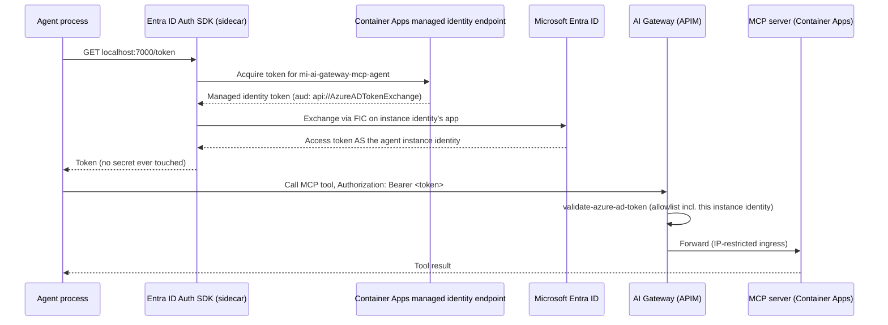
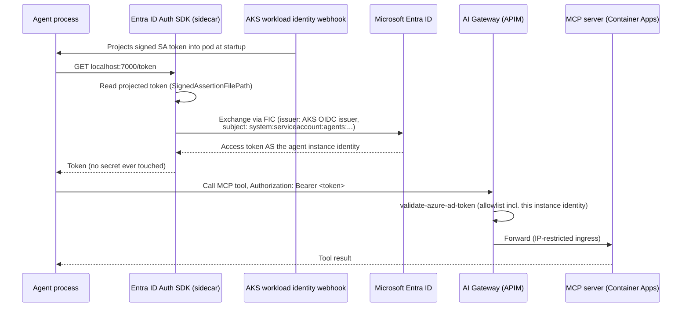
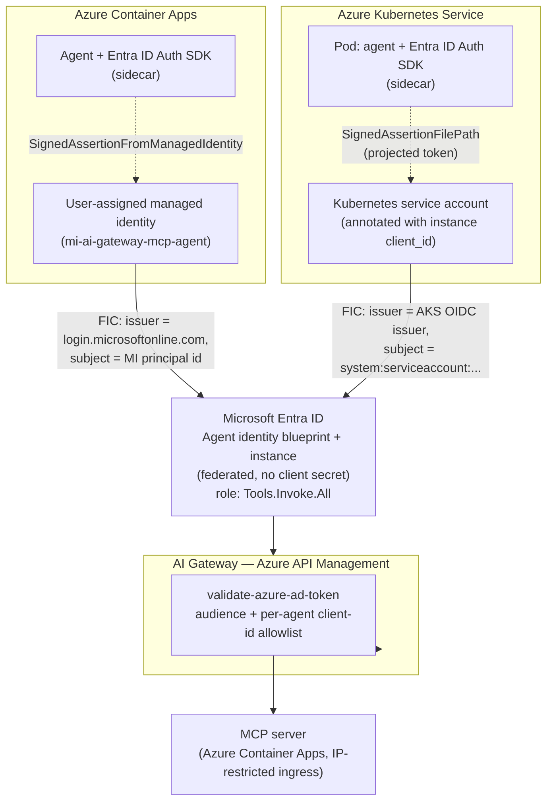

# 8. Self-hosted agent identities: Azure Container Apps & AKS (no Foundry)

Doc 4 registers a self-hosted Foundry agent runner and has it reuse `mcp-client-agent` + a shared client secret — the anti-pattern doc 7 hardens against. Doc 7 covers the Foundry-managed case (identity auto-provisioned on publish) and, generically, the Auth SDK sidecar (§7.4b) and third-party workload-identity federation (§7.4c). This doc is the concrete recipe for the case in between: **you're running your own agent code on your own Azure compute — Container Apps or AKS — not using Foundry Agent Service, but you still want a real per-agent Entra Agent ID identity with no client secret anywhere.**

> Microsoft Entra Agent ID is in **preview**. Same caveat as doc 7.

## 8.1 Where this fits

| | Foundry-managed (doc 7 §7.4/§7.7) | **Container Apps, self-hosted (this doc)** | **AKS, self-hosted (this doc)** | doc 4 today (anti-pattern) |
|---|---|---|---|---|
| Blueprint/instance provisioning | Automatic on agent publish | Manual, via Graph API (doc 7 §7.4) | Manual, via Graph API (doc 7 §7.4) | N/A — no agent identity at all |
| Credential on the instance | None (platform-managed) | Federated identity credential (FIC) trusting a user-assigned managed identity | FIC trusting the AKS OIDC issuer + a Kubernetes service account | Long-lived client secret, shared by every agent |
| Where the credential lives | Nowhere — Foundry handles it | Never on disk — Container Apps' own managed identity token is exchanged for the agent identity's token | Never on disk — a projected Kubernetes service-account token is exchanged for the agent identity's token | `terraform.tfvars` / app registration secret |
| Token-acquisition code | Foundry SDK | Microsoft Entra ID Auth SDK (sidecar), `SignedAssertionFromManagedIdentity` | Microsoft Entra ID Auth SDK (sidecar), `SignedAssertionFilePath` | Hand-rolled `client_credentials` POST |

Same underlying Entra objects (blueprint + instance, doc 7 §7.4's Graph API steps) and the same downstream wiring (role assignment on `mcp-server`, APIM `client-application-ids` allowlist entry) as the Foundry path. The only thing that changes per platform is **what credential the instance identity trusts, and how the agent process gets hold of it.**

## 8.2 Shared mechanism: federate, don't secret

Whichever platform, never put a client secret on the agent instance identity in production. Instead, create a **federated identity credential (FIC)** on the instance identity's app object that trusts a token your compute can already get for free:

- Container Apps → trust the container app's own managed identity.
- AKS → trust the pod's Kubernetes service-account token, via the cluster's OIDC issuer (the same mechanism as standard AKS Workload ID — the only difference is the FIC's target is the *agent identity's* app object instead of a plain app registration).

Either way, the **Microsoft Entra ID Auth SDK (sidecar)** is what actually performs the token exchange — deploy it as a sidecar container next to your agent, and your agent code calls `localhost:7000/token` instead of implementing MSAL/federation logic itself (doc 7 §7.4b).

## 8.3 Container Apps recipe

```bash
# 1. User-assigned managed identity, one per agent instance
az identity create -g rg-ai-gateway -n mi-ai-gateway-mcp-agent

# 2. Assign it to the container app running the agent + sidecar
az containerapp identity assign -g rg-ai-gateway -n agent-runner \
  --user-assigned mi-ai-gateway-mcp-agent

# 3. Create the agent identity blueprint + instance (doc 7 §7.4, Graph API)
#    -> yields an app object for the instance identity

# 4. Federate the instance identity's app to trust the managed identity
az ad app federated-credential create --id <instance-identity-app-id> --parameters '{
  "name": "container-apps-mi-trust",
  "issuer": "https://login.microsoftonline.com/<tenant-id>/v2.0",
  "subject": "<managed-identity-principal-id>",
  "audiences": ["api://AzureADTokenExchange"]
}'

# 5. Grant Tools.Invoke.All on mcp-server to the instance identity's SP (doc 7 §7.4)
# 6. Add the instance identity's client_id to APIM's allowlist (doc 7 §7.7 step 7 pattern)
```

The sidecar's `SignedAssertionFromManagedIdentity` credential type fetches a token for the container app's managed identity, then exchanges it for a token as the agent instance identity — no secret, no certificate, nothing on disk.

### Sequence



## 8.4 AKS recipe

```bash
# 1. Cluster must have OIDC issuer + workload identity enabled
az aks update -g rg-ai-gateway -n aks-ai-gateway \
  --enable-oidc-issuer --enable-workload-identity
AKS_OIDC_ISSUER=$(az aks show -g rg-ai-gateway -n aks-ai-gateway --query "oidcIssuerProfile.issuerUrl" -o tsv)

# 2. Create the agent identity blueprint + instance (doc 7 §7.4, Graph API)
#    -> yields an app object for the instance identity

# 3. Federate the instance identity's app directly to the AKS OIDC issuer + namespace/service account
az ad app federated-credential create --id <instance-identity-app-id> --parameters '{
  "name": "aks-workload-identity-trust",
  "issuer": "'"$AKS_OIDC_ISSUER"'",
  "subject": "system:serviceaccount:agents:ai-gateway-mcp-agent-sa",
  "audiences": ["api://AzureADTokenExchange"]
}'
```

```yaml
# 4. Kubernetes service account, annotated with the instance identity's client_id
apiVersion: v1
kind: ServiceAccount
metadata:
  name: ai-gateway-mcp-agent-sa
  namespace: agents
  annotations:
    azure.workload.identity/client-id: "<instance-identity-client-id>"
```

```bash
# 5. Grant Tools.Invoke.All on mcp-server to the instance identity's SP (doc 7 §7.4)
# 6. Add the instance identity's client_id to APIM's allowlist (doc 7 §7.7 step 7 pattern)
```

The AKS workload-identity webhook projects a signed Kubernetes service-account token into the pod (`/var/run/secrets/azure/tokens/azure-identity-token`). The sidecar's `SignedAssertionFilePath` credential type reads that file and exchanges it via the FIC — same no-secret outcome as Container Apps, different plumbing because a pod isn't an Azure resource the way a container app revision is.

> **One managed identity per cluster, or federate directly?** AKS's newer **identity bindings** feature lets many clusters share one FIC through a proxy, at the cost of a different token audience (`api://AKSIdentityBinding`) than direct federation (`api://AzureADTokenExchange`) — don't mix the two token files for the same identity. This recipe uses direct federation (one FIC per agent instance identity) since it matches doc 7's "one identity per agent" principle without adding a shared proxy component.

### Sequence



## 8.5 System landscape



## 8.6 Terraform: extend the APIM allowlist

Doc 7 §7.7 added `foundry_agent_client_ids` for Foundry-managed agents. The same mechanism covers self-hosted instance identities — it's just a list of client IDs the policy trusts, regardless of what platform minted the token requesting them:

```hcl
# terraform.tfvars
foundry_agent_client_ids = [
  "153f501c-3c97-4110-977e-aae615163d3b", # ai-gateway-mcp-agent (Foundry, hermes-agent project)
  "<instance-identity-client-id>",         # ai-gateway-mcp-agent (self-hosted, Container Apps)
  "<instance-identity-client-id>",         # ai-gateway-mcp-agent (self-hosted, AKS)
]
```

Consider renaming the variable to `agent_instance_client_ids` if self-hosted agents become the common case rather than the exception — the current name is a holdover from when only Foundry-managed agents needed it.

## 8.7 Gotchas

| Gotcha | Detail |
|---|---|
| Don't put a client secret on the instance identity "just to get it working" | Defeats the entire point of Agent ID — see doc 7's whole thesis. FIC is not meaningfully harder to set up than a secret and never needs rotation. |
| AKS: `SignedAssertionFilePath` vs `SignedAssertionFromManagedIdentity` are not interchangeable | Container Apps' native managed identity endpoint doesn't exist inside a pod; a pod always goes through the projected-token file, even if the AKS node pool itself has a managed identity. |
| AKS: identity-binding audience vs direct-federation audience | `api://AKSIdentityBinding` (identity bindings) and `api://AzureADTokenExchange` (direct FIC) are different token files/audiences — mixing them fails with `AADSTS700212`. This doc uses direct federation throughout. |
| One instance identity per agent, not one per platform | Don't create a single "Container Apps agent identity" shared by every agent running there — that's the doc-4 anti-pattern again, just moved from an app registration to a managed identity. |
| Forgetting the APIM allowlist step | Identical failure mode to doc 7 §7.7 step 7 — a perfectly valid, perfectly federated token still 401s at the gateway if its client_id isn't in `foundry_agent_client_ids` (§8.6). |

## Next

Back to [07-agent-identities.md](07-agent-identities.md) for the Graph API blueprint/instance creation steps this doc assumes, or [arb/03-agent-arb-brief.md](arb/03-agent-arb-brief.md) for the review-board-level summary of the whole Agent ID migration.
