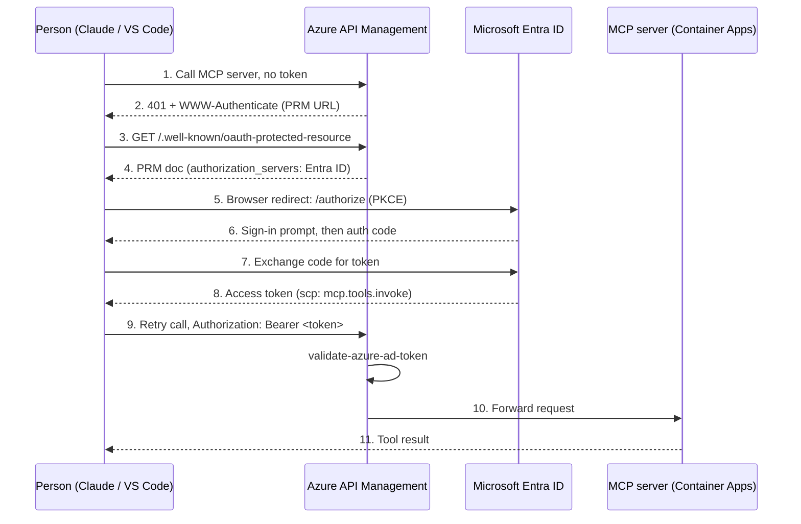
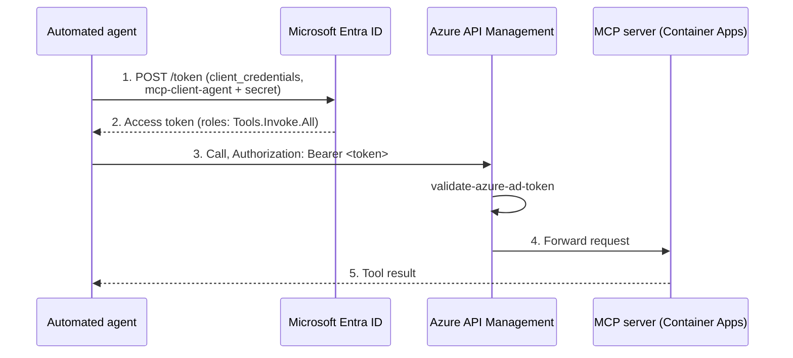
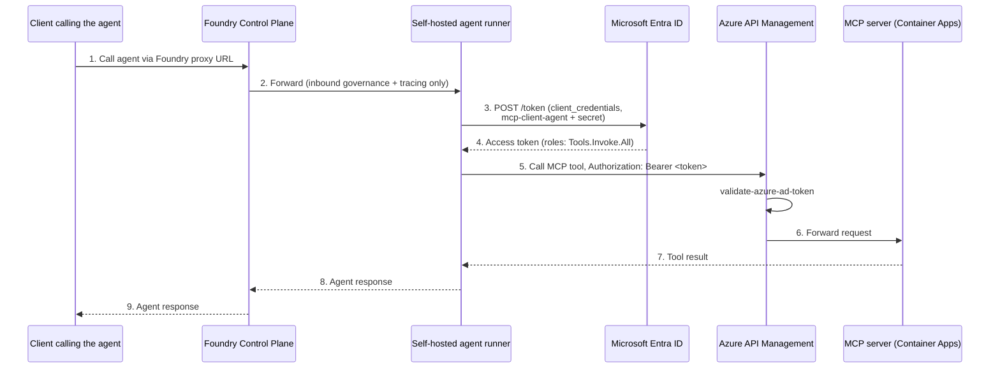

# Azure AI Gateway + Remote MCP Server + Entra ID OAuth2

Step-by-step guide for standing up an Azure API Management (APIM) AI gateway, deploying a remote MCP server to Azure Container Apps, securing the whole path with Microsoft Entra ID OAuth2, connecting a self-hosted Microsoft Foundry agent runner to the MCP server as a tool, exposing LLM models through the same gateway with budgets and rate limits, and governing agent-to-agent (A2A) traffic through the same instance.

## Architecture

Three callers, one APIM-fronted MCP server, two OAuth2 patterns. Each caller's path is shown separately below; all three converge on the same `validate-azure-ad-token` check in APIM and the same MCP server in Container Apps.

### Pattern 1 — Interactive: Claude / VS Code (docs 2 §2.5–2.7, 3 §3.2)

No config makes step 5 happen automatically — it's the MCP client following the spec once the PRM document (step 3–4) exists and `mcp-client-interactive` (doc 3 §3.2) is registered.

### Pattern 2 — Service-to-service: automated agent (docs 2 §2.6–2.7, 3 §3.3)

No browser, no user — headless at request time. Same server app registration and same APIM validation policy as Pattern 1, but the token carries a `roles` claim instead of `scp`.

### Pattern 3 — Self-hosted Foundry agent runner (doc 4)

Foundry Control Plane only sits in the *inbound* path (steps 1–2, 8–9) — governing calls to the runner. The MCP tool call itself (steps 3–7) is identical to Pattern 2 and bypasses Foundry entirely.

## Read order

Entra ID app registrations must exist before you can finish wiring APIM to the MCP server, so read in this order even though the docs are numbered by deployment layer:

1. [01-api-management-ai-gateway.md](01-api-management-ai-gateway.md) — create the APIM instance and AI Gateway tier.
2. [03-entra-id-oauth2.md](03-entra-id-oauth2.md) — register the server + client apps, get IDs/secrets/scope.
3. [02-mcp-remote-server.md](02-mcp-remote-server.md) — deploy the MCP server to Container Apps, secure it with the app registrations from step 2, expose it through the APIM instance from step 1.
4. [04-foundry-agent-mcp-tool.md](04-foundry-agent-mcp-tool.md) — optional: register a self-hosted Foundry agent runner and have it call the MCP server as a tool, reusing the service-to-service app from step 2.
5. [05-llm-gateway-budgets-rate-limits.md](05-llm-gateway-budgets-rate-limits.md) — optional, independent of steps 2–4: expose an LLM model through the same APIM instance from step 1, with per-consumer token budgets, rate limits, and observability.
6. [06-agent-gateway-capabilities.md](06-agent-gateway-capabilities.md) — optional: capability inventory for agent traffic specifically, plus importing and securing an Agent2Agent (A2A) API through the same instance. Covers what's first-class (MCP, A2A) vs. not (ACP, ANP, others) as of this writing.

Each doc calls out the cross-references explicitly so you can also jump straight to whichever layer you're working on.
