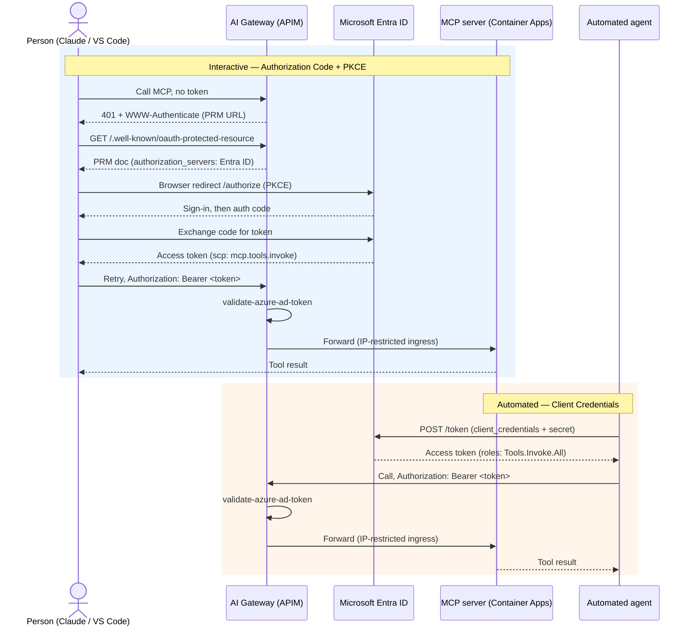
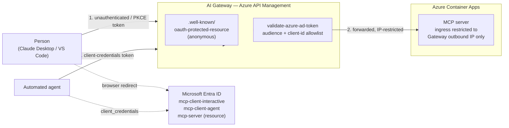

# MCP — ARB Brief

**Ask:** approve running MCP servers as network-isolated Azure Container Apps reachable only through the AI Gateway, secured by one Entra ID resource app validated by one APIM policy, serving both interactive (human) and automated (agent) callers through two different OAuth2 flows.

Full detail: [../02-mcp-remote-server.md](../02-mcp-remote-server.md), [../03-entra-id-oauth2.md](../03-entra-id-oauth2.md). Checked against [Microsoft's MCP best-practices guide](https://github.com/microsoft/mcp-for-beginners/blob/main/08-BestPractices/README.md) and the [Azure APIM MCP security guide](https://learn.microsoft.com/en-us/azure/api-management/secure-mcp-servers) — see doc 02 §2.9 for the gap-closing detail.

## Context

The MCP server holds the actual tool implementations. Whoever can reach it directly bypasses every auth/rate-limit/audit control living in the gateway. It also needs to serve two fundamentally different caller types — a human at a keyboard (Claude Desktop, VS Code) and a headless automated agent — which can't use the same credential-acquisition flow: one needs a browser and consent, the other has neither.

## Decision

**Network:** deploy the MCP server to Azure Container Apps, ingress restricted to the AI Gateway's outbound IP only (`ip_security_restriction`) — never called directly. CORS restricted to an explicit trusted-origin allowlist for browser-based clients.

**Discovery:** serve the RFC 9728 protected-resource metadata document (`/.well-known/oauth-protected-resource`) anonymously, and return `401` + `WWW-Authenticate` pointing at it for any unauthenticated call, so standards-compliant MCP clients discover the auth flow automatically with no out-of-band client config.

**Auth:** one Entra ID resource app registration (`mcp-server`), two client app registrations, one validation policy:

| Caller | App registration | Flow | Token claim checked |
|---|---|---|---|
| Interactive (Claude/VS Code) | `mcp-client-interactive` | Authorization Code + PKCE | `scp: mcp.tools.invoke` |
| Automated agent | `mcp-client-agent` | Client Credentials + secret | `roles: Tools.Invoke.All` |

Both tokens are checked by the same `validate-azure-ad-token` APIM policy — one audience, one client-ID allowlist — regardless of which flow produced the token.

## Sequence

## System landscape

## Why this over the alternatives

| Option | Why not chosen |
|---|---|
| Public Container App, auth enforced inside the app | Bypassable if the app has a bug; duplicates auth logic every MCP server would have to reimplement instead of centralizing it once at the gateway. |
| Static shared API key instead of OAuth2 discovery | Doesn't scale to multiple client types cleanly and isn't what MCP clients expect — the PRM/401 flow is what makes Claude/VS Code work with zero client-side config. |
| Separate resource app / separate policy per caller type | Doubles the policy and audience surface for no security benefit — the trust boundary is the MCP server, not the caller type. |
| Force human callers through client-credentials, or agents through interactive login | Impossible or wrong: no user context/consent for the former, no browser for the latter. |
| Chosen: private Container App behind the gateway, one resource app, two client flows differentiated by claim shape | Minimal policy surface; matches Entra's own delegated-vs-application-permission model instead of fighting it. |

## Risks

| Risk | Mitigation |
|---|---|
| IP allowlisting on a PaaS gateway is best-effort network isolation, not a hard boundary | Acceptable given the real control is token validation, not the IP restriction; upgrade path is Premium v2 + NAT Gateway or VNet integration if stronger isolation is required. |
| `mcp-client-agent` uses a long-lived client secret shared across every automated agent | Tracked as a separate, scoped hardening effort — see the Agent brief. |
| Client-application-ids allowlist must be kept current as new clients are added | Managed as Terraform variables, reviewed like code, not a manual portal edit. |
| v1 vs v2 token / Application ID URI mismatches are an easy source of validation failures | Documented explicitly with the exact resource-URL matching rules — an operational footgun, not a design risk. |
| No throttling on tool invocations — a buggy or compromised agent can hammer `tools/call` in a loop | Closed: `rate-limit-by-key` added to the MCP API policy, keyed on the token's `sub` claim so limiting one caller doesn't stall others sharing an app registration (doc 02 §2.6). |
| Real tools (beyond the current demo `echo`/`time`) need input validation, error sanitization, and per-tool claim checks that the demo skips by design | Documented as the standard for any new tool, not yet needed by the demo server (doc 02 §2.9). Track as a gate on the first non-toy tool shipped. |
| A tool calling a further downstream API would need its own credential — easy to default to hardcoding a secret in the MCP server | Documented pattern: APIM credential manager injects the outbound token at the gateway instead (doc 02 §2.9). Not wired yet — no tool needs it today. |

## Decision requested

Approve network-isolated Container Apps behind the gateway, with the PRM/401 discovery flow and the one-resource/two-flow/one-policy topology, as the standing pattern for every MCP server this org stands up.
