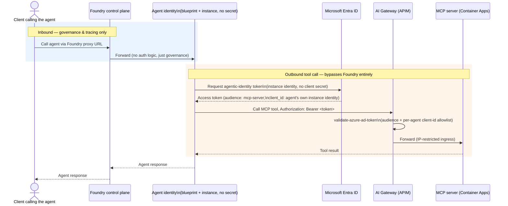
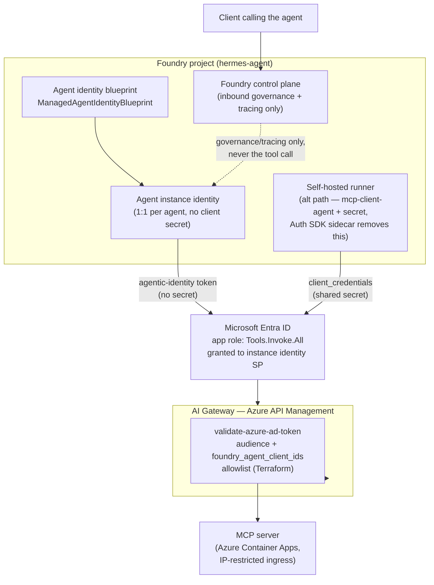

# Agent — ARB Brief

**Ask:** two related decisions —
1. Keep Foundry's control plane strictly in the *inbound* path for any agent it fronts; every outbound tool call bypasses Foundry and goes straight through the gateway on the agent's own credential.
2. Adopt Microsoft Entra Agent ID (blueprint + per-agent instance identity, no client secret) as the standing pattern for new agent identities, replacing the bare app-registration-plus-secret pattern (`mcp-client-agent`) used today.

Full detail: [../04-foundry-agent-mcp-tool.md](../04-foundry-agent-mcp-tool.md), [../07-agent-identities.md](../07-agent-identities.md) (includes a live worked example on this stack, §7.7).

## Context

Two separate but related problems: where does Foundry's governance actually add value for an agent, and what identity does an agent use to authenticate its own tool calls. Today, every automated caller — including Foundry-fronted self-hosted runners — shares one app registration and one long-lived client secret. That's the exact anti-pattern Microsoft's Agent ID guidance calls out: a token from a shared secret can't be traced back to which agent instance made a call, and decommissioning one agent means rotating a secret that breaks every agent sharing it.

## Decision 1 — Foundry stays inbound-only

```
Client → Foundry (inbound governance/tracing only) → Runner → Entra (agent's own credential) → Gateway → MCP server
```

The tool call itself is identical to any other automated-agent call through the gateway (see the MCP brief) and never routes back through Foundry. Foundry's proxy can be added, removed, or reconfigured without touching the tool-calling path.

## Decision 2 — Entra Agent ID replaces the shared secret

| Property | Today (`mcp-client-agent`) | Proposed (Agent ID) |
|---|---|---|
| Credential | Long-lived client secret, shared by every agent | None — managed, short-lived tokens |
| Identity granularity | One app for all agents | One identity per agent instance |
| Audit | Manual correlation | Token carries agent-identity claims natively |
| Revocation | Rotate/delete shared secret — breaks every agent at once | Disable one agent's instance identity independently |
| Status | GA | **Preview** |

For agents built on Azure AI Foundry Agent Service, this identity is auto-provisioned the moment the agent is published (a `ManagedAgentIdentityBlueprint`) — no manual Graph API work. For self-hosted runners not using Foundry Agent Service, doc 07 §7.4b proposes the Auth SDK sidecar as the lower-effort alternative to hand-rolling the Graph `agentIdentityBlueprint` calls directly.

### Proven, not just proposed

Built and tested live on this stack, not only designed on paper: a Foundry-managed agent (`ai-gateway-mcp-agent`) with no app registration and no secret was granted its own role assignment and completed a full call through Entra → gateway → Container Apps MCP server, returning a real tool result. A pre-existing production agent sharing the same connection was confirmed unaffected. Three real gaps surfaced and were fixed along the way (full writeup in doc 07 §7.7):

1. The gateway's client-application allowlist doesn't auto-discover agent identities — each new Foundry agent's client ID has to be added explicitly. Fixed as a Terraform variable (`foundry_agent_client_ids`), reviewed like code, not a manual portal edit.
2. The ARM and data-plane REST surfaces for the same Foundry connection resource don't share a schema — a well-intentioned ARM edit can silently retype a connection (observed firsthand: a connection flipped from `RemoteTool`/`AgenticIdentityToken` to `CustomKeys`/`AAD` on an ARM PUT that "succeeded"). Documented as a hard rule: diff the data-plane view before/after any ARM edit to one of these connections.
3. An unrelated infra gap (container image missing from ACR after a region move) was hit and fixed along the way — not an Agent ID issue, noted for completeness.

## Sequence



## System landscape



## Why this over the alternatives

| Option | Why not chosen |
|---|---|
| Route tool calls back through Foundry as a second hop | Adds latency and a dependency for no security benefit — Foundry's value is on the inbound boundary, not an outbound call the agent makes with its own credential. |
| Keep the shared secret indefinitely | Standing risk: no per-agent audit, no independent revocation, a rotation event breaks every agent at once. |
| Force every self-hosted runner onto raw Graph API calls to adopt Agent ID | Higher effort than necessary; the Auth SDK sidecar (doc 07 §7.4b) gets the same no-secret outcome with less custom code. |
| Chosen: Foundry inbound-only + Entra Agent ID (Foundry-managed auto-provision, or sidecar for self-hosted) | Matches each caller type to the lowest-effort path to a secretless, per-agent-audited identity, without adding an unnecessary hop. |

## Risks

| Risk | Mitigation |
|---|---|
| Entra Agent ID is a preview capability — API surface, portal UX, and Graph schema can change before GA | Migration is additive and reversible: `mcp-client-agent` isn't deleted, it remains the fallback until GA. No production traffic is cut over before then. |
| New per-agent allowlist entry required for every Foundry agent, or it 401s at the gateway | Already codified as a Terraform variable, reviewed the same as any other IaC change. |
| ARM/data-plane schema mismatch for Foundry project connections | Documented standing rule (above); prefer the data-plane/`azd ai connection` surface for connection mutations once interactive auth is available in the target environment. |
| Self-hosted runner path has more manual steps than the Foundry-managed path | Auth SDK sidecar (doc 07 §7.4b) is the recommended lower-effort alternative; tracked as the next piece of this migration. |
| Third-party agent platforms (e.g. AWS Bedrock) aren't covered by either app-registration secrets or Foundry-managed identities | Doc 07 §7.4c covers workload identity federation for that case — no secret crosses the cloud boundary either. |

## Decision requested

Approve both: (1) Foundry-inbound-only as the standing rule for any Foundry-fronted agent, and (2) Entra Agent ID as the default for new agent onboarding — Foundry-managed agents get it automatically, self-hosted runners migrate via the Auth SDK sidecar — with `mcp-client-agent` retained only for existing integrations until Agent ID reaches GA and the self-hosted migration path is complete.
